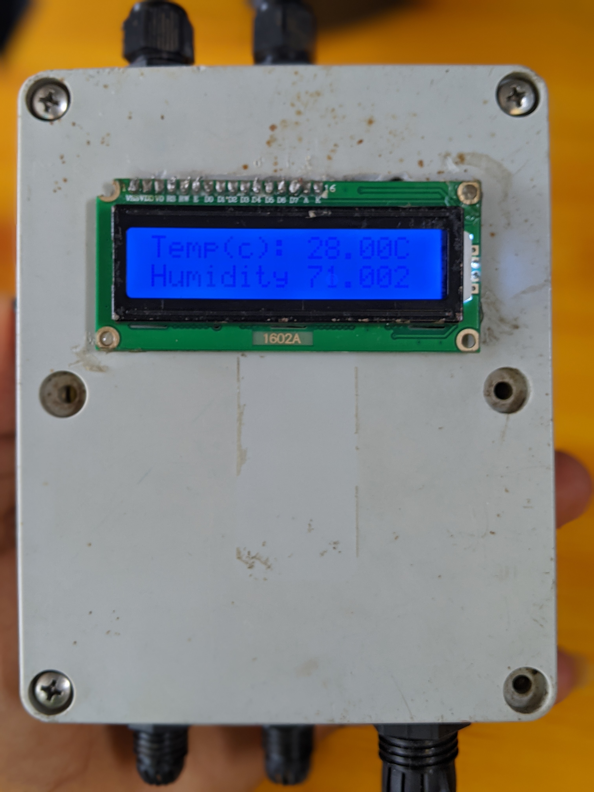
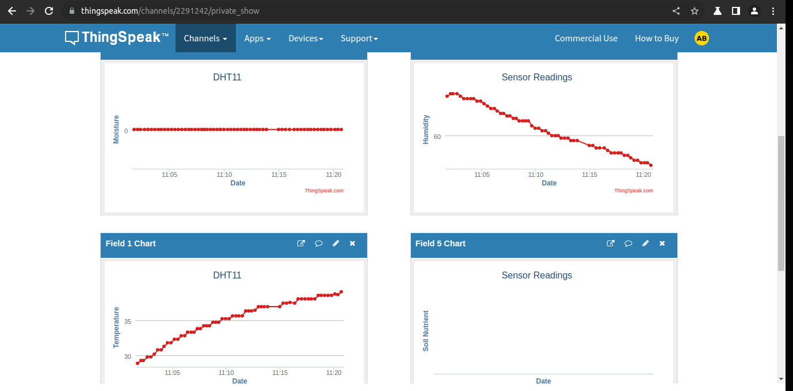

# levon_openSource

    This directory contains LEVON'S side projects which could replicated  and modified by anyone.

# FarmIoT (LEVONATOR)

⭕ As a child, I grew up in a remote area where our primary activity was farming. We cultivated crops such as maize, beans, potatoes and during the dry seasons, we cultivated vegetables such as cabbages and huckleberry. Our farms where located very far from home which sometimes posed security and monitoring problems especially during the dry seasons. I knew I had to come up with a solution not only for myself but for the whole community.

⭕ In vision with SDG 2 and 15, I built an IoT electronic device called the Levonator, which is placed in farms to monitor farm conditions such as temperature, humidity, soil moisture and soil nutrients contents using specific sensors. The sensors collects the data, process and stores it in the cloud which could be accessed and analyzed by the farmer from anywhere around world through his smart phone or computer.

⭕ The sensors used to get data are;
✅ DHT11 sensor.
✅ Resistivity soil moisture sensor.
✅ Soil nutrient sensor (EC), which is still under building.

⭕ The main hardware and electronics used are;
✅ An LCD liquid crystal display which displays the sensor's data locally.
✅ An Arduino nano micro-controller, that process the sensor's data and publishes it online .
✅ WiFi module which connects the device to the internet.
✅ Plastic frame to house all the electronics and sensor.

⭕ The software used are;
✅Arduino IDE: This is used to program our micro-controller.
✅Thingspeak: This saves as the IoT online platform to monitor and analyse the data collected by the device.

⭕ With this device, farmers could now perform the following;
✅Monitor their crop's growing environment over a long distance.

✅Analyze this data and act accordingly such as providing the crops with water and more.

✅Use this data for future planning and improvements.

⭕ Future improvements includes;
✅Adding more security futures to the device which helps to alert the farmer when something critical is going on such as theft.
✅A more reliable means of communication with the farmer if the device has issues accessing the internet or cloud. This could be via GSM.
✅Powering the device with renewable energy, in our case solar energy.

⭕ The picture below shows a real time data collected and published online by the device.

